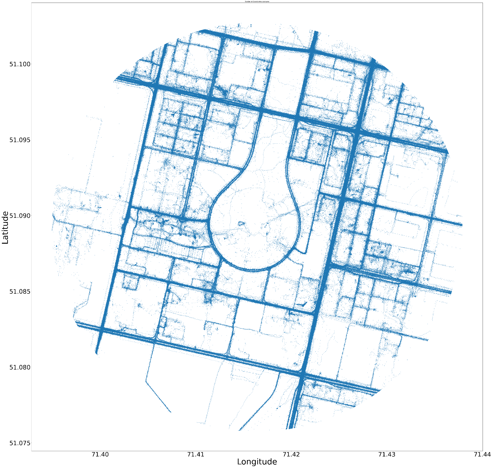
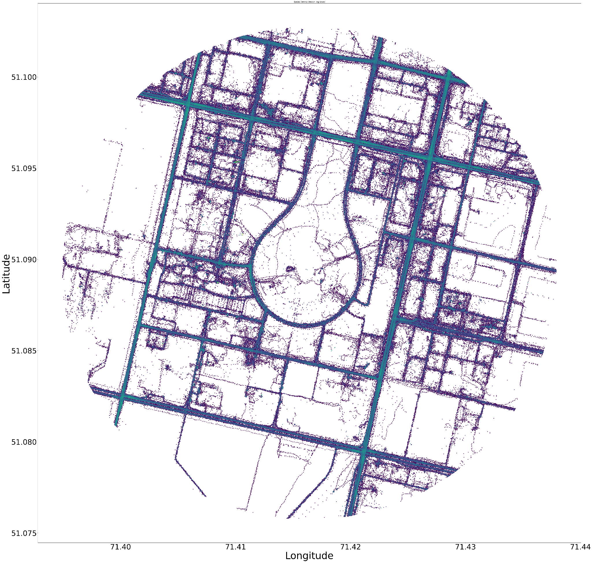
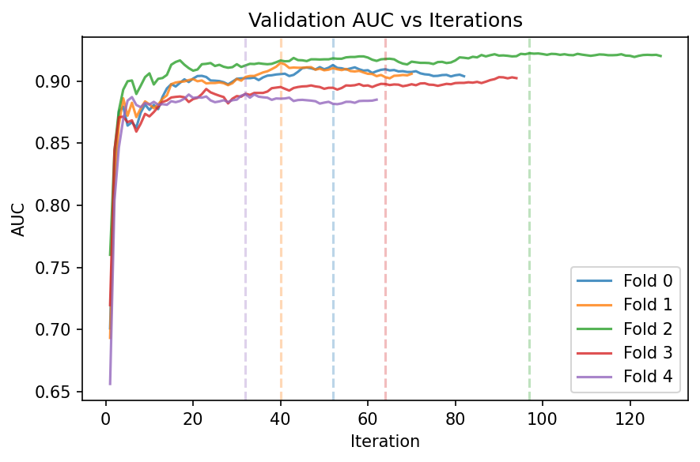

# inRadar

> **Что это?** Прототип «радар безопасности» на обезличенных геотреках inDrive, который **распознаёт опасные места и манёвры**,
> предлагает **безопасные точки посадки** и строит **более безопасный маршрут** (ETA ⊕ β·Risk). Без какой‑либо персональной информации — только агрегаты и k‑анонимность.

<p align="center">
  
</p>

---

## Ключевая ценность
- **Карта риска (SRI 0–100)** по дорогам/районам с понятными причинами (reason‑codes: ILS, WWO, UUT, HBR, HCT, GLD).
- **Безопасные пикапы** в 50–150 м от «красных зон» → меньше остановок «в полосе».
- **Safe‑маршрут A→B**: немного дольше по времени, но заметно безопаснее.
- **Готово к встройке**: геозоны и мягкие нуджи для водителей из коробки.
- **Этика по умолчанию**: k‑анонимность, агрегирование, фильтры мостов (altitude), без реидентификации.

---

## Структура репозитория

```
README.md
app.py                       # демо‑дашборд Streamlit
assets/                      # статические картинки/логотипы (опц.)
Altitude Distribution.png
Azimuth Rose.png
Heatmap.png
Scatter.png
Speed Distribution.png
data/
  raw/
    geo_locations_astana_hackathon   # исходный датасет
notebooks/
  S00_setup.ipynb                    # константы/утилиты
  S01_EDA_inDrive_Astana.ipynb       # EDA
  S02_mapmatching_safety.ipynb       # привязка к OSM (направление/расстояния)
  S03_safety_features.ipynb          # фичи point/edge/hex + микросегменты
  S04_detectors.ipynb                # детекторы + EB‑сглаживание
  S05_label_model_ML.ipynb           # weak‑supervision + LightGBM
  S06_graph_smoothing_gnn.ipynb      # графовое сглаживание + сборка SRI
  S07_safe_spots_geofences.ipynb     # безопасные точки и геозоны
requirements.txt
```
> В процессе работы ноутбуки создают папку `data/processed/` с промежуточными файлами (`*.parquet`, `*.geojson`, `osm_graph.graphml`).

---

## Быстрый старт

### 1) Установка
```bash
python -m venv .venv && source .venv/bin/activate  # Windows: .venv\Scripts\activate
pip install -r requirements.txt
```

### 2) Данные
Загрузите файл `geo_locations_astana_hackathon` в `data/raw/` (как в дереве выше).

### 3) Прогон пайплайна (по порядку)
1. `S00_setup.ipynb` — проверить константы/пороги.
2. `S01_EDA_inDrive_Astana.ipynb` — ознакомиться с качеством данных.
3. `S02_mapmatching_safety.ipynb` — загрузить/скачать OSM‑граф (требуется интернет при первом запуске), получить `artifacts/matched_points.parquet`.
4. `S03_safety_features.ipynb` — собрать фичи point/edge/hex (`features_*.parquet`).
5. `S04_detectors.ipynb` — посчитать события (WWO/ILS/UUT/HBR/HCT/GLD) + Empirical Bayes (`events_*.parquet`, `eb_*.parquet`).
6. `S05_label_model_ML.ipynb` — **label‑model → pseudo‑labels**, обучить **LightGBM** (AUC/PR, OOF), сохранить `ml_edge_pred.parquet`.
7. `S06_graph_smoothing_gnn.ipynb` — лаплассиан/итеративное сглаживание, собрать **SRI 0–100** → `sri_edge.parquet`.
8. `S07_safe_spots_geofences.ipynb` — построить **геозоны** (`safety_geofences.geojson`) и **безопасные точки** (`safe_pickups.geojson`).

### 4) Демо‑дашборд (для этого у вас должны быть все .parquet, которые вы должны создать через ноутбуки выше)
```bash
streamlit run app.py
```
В дашборде:
- переключатель **SRI heatmap** / **Density**;
- фильтры: **SRI ≥ τ**, **k‑анонимность**;
- попапы с **reason‑codes** и показателями `n_obs / n_ids`;
- метрика **Coverage@R** для safe‑точек;
- сравнение маршрутов **обычный vs безопасный** (ETA ⊕ β·Risk).

---

## Данные и EDA (важные факты)

- **1.262.687** точек × 6 полей: `randomized_id, lat, lng, alt, spd (м/с), azm (°)`.
- Пропусков нет, ~5.7% полных дублей, ~1.2% отрицательных скоростей → очищаем.
- Скорости реалистичны для города (p95 ≈ 16.5 м/с ≈ 59 км/ч).
- Ортогональная уличная сетка (преобладают E/W/N/S по азимуту).

<p align="center">
  
  
</p>

<p align="center">
  
  
  
</p>

---

## Архитектура и подход

```
CSV → QC/Очистка → UTM/H3 → Map‑Matching (угол ≤ 30°)
   → Feature Store (point/edge/hex + микросегменты)
   → Детекторы (WWO/ILS/UUT/HBR/HCT/GLD)
   → Empirical Bayes (устойчивость малых выборок)
   → Weak Supervision (label model) + LightGBM
   → Графовое сглаживание (лаплассиан/итерации)
   → SRI 0–100 + reason‑codes
   → Safe Pick‑Ups (facility location) & Геозоны
   → Демо‑дашборд (Streamlit)
```

**Почему так:** без времени полагаемся на **пространственные сигналы** и **физику без ∆t** (формулы `v²/2s`),
объединяем точные правила через **weak‑supervision**, обучаем **LightGBM** и стабилизируем сеть **графовым сглаживанием**.
Выходы — **объяснимые** и **операционализируемые**.

---

## Метрики и валидация

- **Coverage@R**: сколько «массы ILS» покрывают K безопасных точек (цель: +30–50% vs случайный выбор).
- **ΔETA / ΔRisk**: безопасный маршрут должен снижать Risk ≥ 30% при росте ETA ≤ 3–5%.
- **AUC / PR** для ML‑слоя (LightGBM) на **spatial‑friendly CV**.
- **Стабильность** топ‑N зон при бутстрэпе; доверие через `n_obs`/`n_ids`.
- **Качество данных**: отчёты EDA и фильтры (winsorize alt, speed‑clips, мосты).

<p align="center">
  
  
</p>

---

## Приватность и надёжность

- Публикуем **только агрегаты** (hex/edge), применяем **k‑анонимность (k=10)**.
- Исключаем ложные флаги: мосты/эстакады через `alt_residual`, «неуверенный» match снижает вес.
- Нет попыток реидентификации, никаких внешних персональных источников.
- Ограничения описаны ниже; в коде есть тумблеры порогов и фильтров.

---

## Сценарии применения для inDrive

1. **Операции / Диспетчеры:** хот‑лист геозон, нуджи «не останавливаться в полосе», размещение водителей у безопасных карманов.
2. **Пассажирский Safe‑режим:** безопасные точки подачи и безопасный маршрут.
3. **Аналитика качества городской сети:** «узкие места» по SRI и free‑flow.
4. **Роадмап:** Driver Safety Score (при наличии служебных ID) — поведенческий скрининг.

---

## Артефакты, которые генерируются

- `artifacts/osm_graph.graphml` — граф OSM (кэш).
- `artifacts/matched_points.parquet` — точки с привязкой к рёбрам.
- `artifacts/features_point.parquet`, `features_edge.parquet`, `features_hex.parquet`.
- `artifacts/events_edge.parquet`, `events_hex.parquet`, `eb_*.parquet`.
- `artifacts/ml_edge_pred.parquet` — вероятности ML.
- `artifacts/sri_edge.parquet` — итоговый индекс риска.
- `artifacts/safety_geofences.geojson`, `safe_pickups.geojson` — слои для дашборда.

---

## Troubleshooting

- **OSM не скачивается / тайлы не грузятся.** Запустите `S02` с интернетом один раз; граф кэшируется в `artifacts/`.
- **Мало «горячих» зон.** Понизьте `SRI threshold` в `app.py`/дашборде или ослабьте пороги детекторов в `S00_setup.ipynb`.
- **Пины попали на магистрали.** Ужесточите критерии подбора (`freeflow < 10 м/с`, `dist2junction ∈ [20,80] м`).
- **Память/время.** Работайте с сэмплами (параметры в ноутбуках помечены как `SAMPLE_N`).

---

## Ограничения и что дальше
- Нет исходных **временных меток** → мы сознательно используем кинематику без ∆t и пространственные агрегаты.
- В будущем: временные слоты (если добавят time), расширенные POI/светофоры, прод‑SDK для подсказок водителю, Driver Safety Score.

---

## Лицензии и данные
- Данные обезличены и предназначены **исключительно** для целей хакатона/исследования.
- Любая публичная публикация карт/геозон — **только** в агрегированном виде и при k‑анонимности.

---

С вопросами — **Issues/PR** приветствуются.
# inRadar
